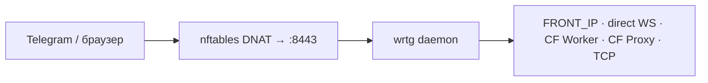
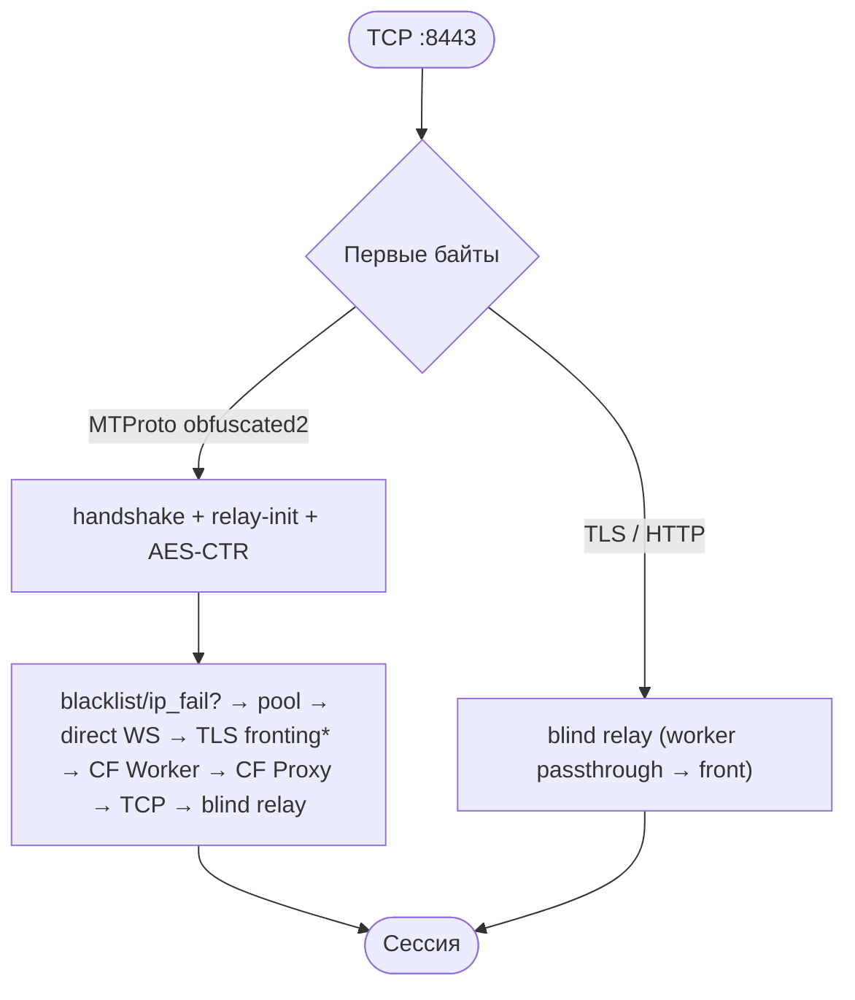

# wrtg

**Прозрачный прокси Telegram для OpenWrt.** Роутер сам перенаправляет трафик Telegram через демон wrtg (WebSocket, Cloudflare fallback) — на телефонах и ПК в LAN ничего настраивать не нужно.

[](https://github.com/onebany/wrtg/releases)
[](LICENSE)
[](https://github.com/onebany/wrtg/actions/workflows/build.yml)
[](https://openwrt.org)

**Version:** 0.5.39 · **Last updated:** 2026-08-28

[Релизы](https://github.com/onebany/wrtg/releases) · [CHANGELOG.md](CHANGELOG.md) · [Исходник CF Worker](openwrt/cf-worker.js) · [Issues](https://github.com/onebany/wrtg/issues)

---

## Оглавление

- [Возможности](#возможности)
- [Быстрый старт](#быстрый-старт)
- [Установка](#установка)
- [Настройка](#настройка)
- [CF Worker](#cf-worker)
- [CF Proxy](#cf-proxy)
- [Диагностика](#диагностика)
- [Ограничения](#ограничения)
- [Как это работает](#как-это-работает) — архитектура, поток соединения, модули
- [Глоссарий](#глоссарий)
- [Разработчикам](#разработчикам)

---

## Возможности

- **Прозрачный перехват.** nftables DNAT забирает TCP к IP Telegram (80/443/5222). Клиенты о прокси не знают.
- **Цепочка запасных путей:** direct WS pool → direct WS → TLS fronting → CF Worker → CF Proxy → TCP → blind relay. На каждой ступени свой blacklist и cooldown, так что мёртвый путь не пробуют заново.
- **CF Worker и CF Proxy.** Фронт Telegram отвечает HTTP 302 на DC1, DC3 и DC5, поэтому им нужен туннель через Cloudflare. Worker вы поднимаете сами на бесплатном плане; CF Proxy работает из коробки на общем пуле доменов.
- **Демон запоминает соответствие IP → DC** из handshake (`dc_learn`), а не полагается на зашитый список.
- **LuCI-приложение:** статус, настройки, логи и обновление из веб-интерфейса роутера.
- **Один статический бинарник** (~3 МБ, ~4 МБ RAM) без зависимостей: `x86_64`, `aarch64`, `armv7`, `mipsel` (MT7621, напр. Xiaomi Mi Router 3G).
- **sha256 при установке, токен на Worker, лимиты соединений и таймауты** против исчерпания ресурсов.

---

## Быстрый старт

На роутере OpenWrt:

```sh
wget -qO- https://raw.githubusercontent.com/onebany/wrtg/main/bootstrap.sh | sh
```

Проверка после установки:

```sh
/etc/init.d/wrtg status
wrtg --check          # DNS + WSS probes; exit 0 = OK
```

Откройте Telegram в LAN. В логах (`logread -e wrtg`) появится `direct handshake OK` или `WS connected`. Клиентам ничего настраивать не нужно.

DC1, DC3 и DC5 почти всегда отвечают на direct WS редиректом HTTP 302: фронт Telegram их не обслуживает. Эти DC подхватит [CF Proxy](#cf-proxy) на общем пуле доменов, он включён по умолчанию. Свой [CF Worker](#cf-worker) быстрее и не зависит от чужих доменов.

---

## Установка

### Стандартная (GitHub)

```sh
wget -qO- https://raw.githubusercontent.com/onebany/wrtg/main/bootstrap.sh | sh
```

`bootstrap.sh` скачивает релиз, проверяет sha256 и запускает `install.sh` (бинарник, конфиг, nft, cron, LuCI).

Поддерживаемые CPU: `x86_64`, `aarch64`, `armv7`, `mipsel` (mips32r2, напр. MT7621 — Xiaomi Mi Router 3G). Big-endian MIPS не поддерживается.

Опции через env: `VER=vX.Y.Z` (конкретный релиз вместо последнего), `WRTG_REPO=owner/repo` (другой GitHub-репо), `ASSUME_YES=1`, `SKIP_LUCI=1`, `CF_WORKER_DOMAIN=…`.

### Офлайн-установка (GitHub недоступен с роутера)

Некоторые провайдеры DPI-фильтруют хосты раздачи релизов GitHub (`release-assets.githubusercontent.com`): коннекты случайно дропаются, и даже ретраи не помогают. В этом случае бандл можно принести на роутер вручную.

На машине, где GitHub доступен:

```sh
wget https://github.com/onebany/wrtg/releases/latest/download/wrtg-openwrt.tar.gz
wget https://github.com/onebany/wrtg/releases/latest/download/SHA256SUMS
tar -czf - wrtg-openwrt.tar.gz SHA256SUMS | ssh root@<роутер> 'tar -xzf - -C /tmp'
```

На роутере:

```sh
cd /tmp
grep wrtg-openwrt.tar.gz SHA256SUMS | sha256sum -c -   # должно быть: OK
tar -xzf wrtg-openwrt.tar.gz
SKIP_BUILD=1 sh wrtg/install.sh
```

Это тот же бандл и тот же `install.sh`, что запускает `bootstrap.sh`, — с той же проверкой sha256.

### Обновление

- **LuCI**: Services → wrtg → Status → **Check for updates / Update**.
- **CLI**: `/etc/wrtg/check-update.sh update` либо повторите команду установки.

Конфиг и learned DC-карта при обновлении сохраняются.

### Удаление

```sh
sh uninstall.sh        # или FORCE=1 sh uninstall.sh
```

### После установки

```sh
/etc/init.d/wrtg status
wrtg --check
```

**LuCI** (если не `SKIP_LUCI=1`): **Services → wrtg** — Status (service-контролы, live-статус, **Check for updates / Update** с GitHub releases), Settings (quick-set + Save & Reload, DC→IP learning, `--check`, raw config), Logs (фильтр-чипы), Documentation (рендер `/etc/wrtg/README.md`). CLI того же пути: `/etc/wrtg/check-update.sh check|update`.

---

## Настройка

Файл `/etc/wrtg/config`. Front/домены/DC-learn применяются вживую: **`/etc/init.d/wrtg reload`** (SIGHUP, без разрыва сессий). Полный **`restart`** нужен только для `LISTEN`/nftables.
Только CIDR/nft: `/etc/wrtg/update-cidr.sh`.

### Основное

| Переменная | Описание | По умолчанию |
|------------|----------|--------------|
| `ROUTER_IP` | LAN IP роутера (цель DNAT) | авто при install |
| `LAN_IF` | Интерфейс LAN | авто (`br-lan`) |
| `LISTEN` | Адрес демона (`/etc/wrtg/config`, init передаёт `--listen`) | `0.0.0.0:8443` |
| `WRTG_LISTEN` | То же при ручном запуске бинарника с env | `0.0.0.0:8443` |
| `FRONT_IP` / `WRTG_FRONT_IP` | Front IP для WS и TCP | `149.154.167.220` |
| `WRTG_FRONT_DCS` | Каким DC применять FRONT_IP: `2,4` / `all` / `none` / список | `2,4` |
| `DC{N}_FRONT_IP` | Per-DC front IP (важнее скоупа) | — |
| `WRTG_DC_IPS` | Per-DC: `1:ip,2:ip` | — |

DC1/DC3/DC5 часто отвечают HTTP 302 на direct WS — для них нужен **CF Worker** (см. ниже).

### IP → DC (dc_learn)

| Переменная | Описание | По умолчанию |
|------------|----------|--------------|
| `WRTG_DC_LEARN_FILE` | Learned mappings | `/etc/wrtg/dc-ips-learned.txt` |
| `WRTG_DC_IPS_FILE` | Admin override | `/etc/wrtg/dc-ips.txt` |

Формат файлов: `<IP> <DC> [media]` (по строке). В LuCI **Settings → DC → IP learning**: ручной override (IP/DC/media) и очистка learned-карты — оба применяются вживую (reload).

### Cloudflare fallback

| Переменная | Описание | По умолчанию |
|------------|----------|--------------|
| `CF_WORKER_DOMAIN` | Worker hostname(s), через запятую | пусто |
| `WRTG_CF_WORKER_TOKEN` | Secret = Worker `WRTG_TOKEN` | пусто |
| `CF_PROXY_DOMAIN` | Свой CF-proxied домен(s) | пусто |
| `WRTG_CFPROXY_AUTO` | Публичный CF Proxy pool | вкл, если не задан свой `CF_PROXY_DOMAIN` |
| `WRTG_NO_CFPROXY` | Отключить CF Worker/Proxy fallback и worker passthrough | выкл |
| `WRTG_NO_WORKER_PASSTHROUGH` | Не туннелировать media через Worker | выкл |

### Таймауты и пулы

| Переменная | Описание | По умолчанию |
|------------|----------|--------------|
| `WRTG_WS_POOL_SIZE` | Direct WS pool per DC, только DC с front (max 8) | `2` |
| `WRTG_WS_POOL_TTL_SEC` | Pool TTL | `120` |
| `WRTG_CF_WORKER_POOL_SIZE` | CF Worker pool per (DC, media), max 4 — **на слот**, а не всего | `2` |
| `WRTG_CF_WORKER_POOL_TTL_SEC` | CF Worker pool TTL | `120` |
| `WRTG_WS_BLACKLIST_TTL_SEC` | Blacklist TTL после HTTP 302 | `2700` |
| `WRTG_IP_FAIL_COOLDOWN_SEC` | Cooldown после WS timeout к FRONT_IP | `3600` |
| `WRTG_DC_FAIL_COOLDOWN_SEC` | Adaptive WS timeout per DC | `60` |
| `WRTG_WS_FAIL_TIMEOUT_SEC` | WS connect timeout | `5` |
| `WRTG_WS_FAIL_TIMEOUT_FAST_SEC` | Быстрый timeout после fail | `2` |

Пулы наполняются **по спросу**: греются только слоты, которые роутер реально использует (`ws_pool` — DC с front-таргетом, `cf_worker_pool` — пары `(DC, media)` из learned-карты), а фоновый refill пропускает слоты, к которым не обращались 10 минут. Размер задаётся **на слот**: при `WRTG_CF_WORKER_POOL_SIZE=4` прогрев всех `5 DC × media` открывал бы 40 соединений и съедал бы около трети суточной квоты Cloudflare на холостом ходу. Непрогретый слот работает — первое соединение платит один холодный connect, дальше слот греется сам.

### TLS fronting (opt-in)

| Переменная | Описание | По умолчанию |
|------------|----------|--------------|
| `WRTG_FRONTING_SNI` | SNI для fronting (пусто = выкл) | пусто |
| `WRTG_FRONTING_COOLDOWN_SEC` | Cooldown после неудачи | `1800` |

### CF Proxy tuning

| Переменная | Описание | По умолчанию |
|------------|----------|--------------|
| `WRTG_CFPROXY_429_COOLDOWN_SEC` | Начальный 429 cooldown | `45` |
| `WRTG_CFPROXY_429_MAX_COOLDOWN_SEC` | Макс. 429 cooldown | `300` |
| `WRTG_CFPROXY_PARALLEL` | Параллельные CF Proxy попытки | `2` |
| `WRTG_CFPROXY_MAX_ATTEMPTS` | Доменов на сессию | `3` |
| `WRTG_DOH_CACHE_SEC` | DoH cache TTL | `300` |

### Keepalive

| Переменная | Описание | По умолчанию |
|------------|----------|--------------|
| `WRTG_WS_PING_SEC` | Idle WS ping | `30` |
| `WRTG_TCP_KEEPALIVE_SEC` | TCP keepalive | `30` |
| `WRTG_MAX_CONNS` | Макс. одновременных соединений (backpressure-семафор; 0/unset → 1024) | `1024` |
| `WRTG_STATS_SOCKET` | Unix-сокет снимка `wrtg --stats` | `/var/run/wrtg.sock` |
| `WRTG_SKIP_SRC` | LAN-хосты (IP/CIDR через пробел), не перехватываемые DNAT | пусто |

CLI: `--listen ADDR`, `--front-ip IP`, `--check`, `--stats`, `--version`.

### Константы

| Параметр | Значение |
|----------|----------|
| WS hosts | `kws{dc}.web.telegram.org`, `kws{dc}-1.web.telegram.org` (media) |
| WS path | `/apiws` |
| DC IPs | DC1 `149.154.175.50`, DC2 `149.154.167.51`, DC3 `149.154.175.100`, DC4 `149.154.167.91`, DC5 `149.154.171.5`, DC203 `91.105.192.100` |
| nft table | `inet tg_tproxy` |

---

## CF Worker

CF Worker — основной fallback для DC с HTTP 302 (DC1/DC3/DC5) и media passthrough.

### Безопасность

- Только IPv4 из Telegram CIDR; порты 80, 443, 5222.
- Токен **обязателен**: `WRTG_TOKEN` в Worker = `WRTG_CF_WORKER_TOKEN` на роутере. Без него Worker отвечает `503` и не работает — раньше он в этом случае молча становился публичным открытым реле, которое находят сканеры и жгут вашу квоту Cloudflare.
- Используйте актуальный код из `openwrt/cf-worker.js` (не open proxy).

### Развёртывание

1. [Cloudflare Dashboard](https://dash.cloudflare.com) → **Workers & Pages** → **Create Worker**.
2. **Edit code** → вставьте содержимое `openwrt/cf-worker.js` → **Deploy**. В LuCI (Services → wrtg → Documentation) код воркера показан с кнопкой копирования.
3. **Settings → Variables and Secrets** → encrypted secret `WRTG_TOKEN=<random>` (`openssl rand -hex 32`). Без этого шага Worker отвечает `503` на любой запрос.
4. Скопируйте hostname `name.username.workers.dev`.
5. На роутере:

```sh
CF_WORKER_DOMAIN="name.username.workers.dev"
WRTG_CF_WORKER_TOKEN="<то же значение>"
/etc/init.d/wrtg restart
```

Несколько Worker через запятую; порядок сохраняется.

---

## CF Proxy

WSS-туннель через домен, спрятанный за Cloudflare CDN. Это последняя ступень перед blind relay и единственный путь, который остаётся у DC1, DC3 и DC5, когда своего Worker нет.

### Свой домен

```sh
CF_PROXY_DOMAIN="proxy.example.com"
/etc/init.d/wrtg restart
```

wrtg подключается к `wss://kws{N}[-1].proxy.example.com/apiws`.

### Общий pool

Работает по умолчанию, пока вы не задали свой `CF_PROXY_DOMAIN`. Список из 20 доменов зашит в бинарник и раз в час обновляется из репозитория Flowseal/tg-ws-proxy. На соединение wrtg берёт не больше трёх доменов: первый последовательно, остальные два параллельной гонкой.

Домены чужие, и трафик DC1/DC3/DC5 пойдёт через них. Если это не устраивает, поднимите свой Worker или домен, либо выключите pool:

```sh
WRTG_CFPROXY_AUTO="0"
/etc/init.d/wrtg restart
```

Учтите, что после выключения DC1, DC3 и DC5 останутся без пути: их трафик уйдёт в blind relay на заблокированный IP. Демон предупредит об этом в логе при старте.

---

## Диагностика

### Быстрая проверка

```sh
/etc/init.d/wrtg status
wrtg --check          # DNS + WSS probes; exit 0 = OK
wrtg --stats          # счётчики живого демона
logread -e wrtg | tail
nft list table inet tg_tproxy
```

Откройте Telegram в LAN — в логах: `direct handshake OK` или `WS connected`.

### `wrtg --stats`

Снимок работающего демона через unix-сокет (`WRTG_STATS_SOCKET`, по умолчанию `/var/run/wrtg.sock`): на какую ступень fallback-цепочки садится трафик, насколько выбран семафор соединений, глубина каждого слота пулов.

```sh
wrtg --stats
```

```text
wrtg 0.5.34
connections active=12 capacity=1024
counters
  accepted 48213
  ws_pool_hit 30112
  cf_worker 8801
  cf_proxy 512
  cf_proxy_media 37
  worker_passthrough 4120
  media_http_rejected 84
  all_paths_failed 3
  idle_reaped 17
  passthrough_no_data 0
  ...
ws pool
  DC2 2
  DC4 1
cf worker pool
  DC1 4
  DC3 4
```

Как читать:

| Счётчик | О чём говорит |
|---------|---------------|
| `active` близко к `capacity` | Семафор соединений заканчивается (симптом зависания из 0.5.28). |
| `all_paths_failed` растёт | Цепочка не сработала целиком. Считайте долю от суммы `ws_pool_hit + ws_direct + cf_proxy + tcp_fallback + all_paths_failed`; `blind_relay` для этого не годится, он растёт и на обычном не-MTProto трафике. |
| `cf_proxy` = 0 при живом трафике | Ступень не используется. Проверьте `cf-proxies=N` в строке старта. |
| `media_http_rejected` растёт | Фронт отвечает на media поверх MTProto-over-HTTP редиректом вместо данных. Картинки и стикеры будут грузиться вечно. |
| `passthrough_no_data` растёт | Worker поднимает туннель, но до DC не доходит. |

### `wrtg --check`

Резолвит DNS всех Worker/Proxy-доменов, затем проверяет WSS-handshake для **каждого DC1–DC5** по его реальному пути: front-DC (по умолчанию 2/4) — direct WSS на `FRONT_IP`; остальные — через первый CF Worker (`/apiws?dst=…`), иначе CF Proxy, на реальный IP DC. Не запускает демон; при ручном запуске конфиг подхватывается из `/etc/wrtg/config` автоматически.

### CF Worker

```sh
nslookup name.username.workers.dev
curl -i https://name.username.workers.dev/apiws   # ожидается 426 без WS Upgrade
logread -e wrtg | grep -E 'CF worker|worker passthrough'
```

| Симптом | Решение |
|---------|---------|
| `cf-workers=0` | Проверьте `CF_WORKER_DOMAIN`, restart |
| HTTP 503 | `WRTG_TOKEN` не задан в Worker |
| HTTP 403 | Secret mismatch или destination вне CIDR |
| TLS error | Hostname, DNS, время на роутере |
| Timeout | Доступ к `*.workers.dev` с роутера (`curl`, `nslookup`) |

### CF Proxy

```sh
nslookup kws1.proxy.example.com
curl -i https://kws1.proxy.example.com/apiws
logread -e wrtg | grep -i 'CF proxy'
```

Домены общего пула публикуют только поддомены `kws{N}.<домен>`. У самого домена A-записи нет, а media-хостов `kws{N}-1.<домен>` не существует, поэтому media через CF Proxy не ходит.

Пул неоднороден: один и тот же домен может обслуживать `kws4` и отвечать 404 на `kws2`. Замер на живом пуле дал от 6 до 16 рабочих доменов из 20 в зависимости от DC. Если пул часто мимо, поднимите `WRTG_CFPROXY_MAX_ATTEMPTS` — доменов на сессию.

Если pool нестабилен, задайте `WRTG_CFPROXY_AUTO="0"` и поднимите свой Worker или домен.

### Общие проблемы

| Симптом | Что проверить |
|---------|---------------|
| Telegram не подключается | `wrtg --check`, nft rules, `ROUTER_IP`/`LAN_IF` |
| HTTP 302 на WS | Настройте `CF_WORKER_DOMAIN` |
| Media/CDN не грузятся | Сначала `media_http_rejected` в `--stats`. Растёт — фронт отдаёт редирект вместо данных, помочь может только живой Worker passthrough (`CF_WORKER_DOMAIN`, без `WRTG_NO_WORKER_PASSTHROUGH`) |
| Медленный fallback | Задайте `WRTG_CFPROXY_AUTO="0"` и используйте свой Worker |
| `passthrough_no_data` растёт в `--stats` | Клиент с собственным обходом DPI за wrtg — исключите его через `WRTG_SKIP_SRC` |
| `curl: (28)` при установке | DPI провайдера дропает GitHub — [офлайн-установка](#офлайн-установка-github-недоступен-с-роутера) |

---

## Ограничения

- **Голос/видео** — UDP/WebRTC не проксируется; wrtg перехватывает только TCP (сигналинг).
- **IPv4 only** — `SO_ORIGINAL_DST` работает только с IPv4.
- **Worker deploy.** Изменив `openwrt/cf-worker.js`, вы должны выкатить его в Cloudflare отдельно.
- **Общий CF Proxy pool** проектом не контролируется: домены чужие и могут отвалиться в любой момент.
- **Media поверх MTProto-over-HTTP.** Клиент тянет часть медиа запросами `POST /api` на порт 80. Фронт Telegram отвечает на них HTTP 302 при любом значении `Host`, а CF Proxy и Worker обслуживают только `/apiws`. Рабочего пути для этого транспорта сейчас нет; счётчик `media_http_rejected` показывает, насколько часто это происходит.

---

## Как это работает

**wrtg** — прозрачный TCP-прокси Telegram для OpenWrt. Клиентам не нужно настраивать прокси: nftables перенаправляет исходящий TCP к IP Telegram (порты 80, 443, 5222) на локальный демон, который расшифровывает MTProto handshake и перенаправляет трафик через WebSocket, Cloudflare Worker или прямое TCP-соединение. Работает через **DNAT** и `SO_ORIGINAL_DST`, без kernel TPROXY.

### Развёртывание



1. **nftables** (`inet tg_tproxy`, chain `prerouting`) перехватывает TCP 80/443/5222 к CIDR Telegram из `/var/lib/wrtg/cidrs.txt` (официальный список + опционально `/etc/wrtg/cidr-extra.txt` через `update-cidr.sh`).
2. **DNAT** перенаправляет на `ROUTER_IP:8443`.
3. **wrtg** слушает с `IP_TRANSPARENT`, восстанавливает оригинальный адрес через `SO_ORIGINAL_DST`.

| Компонент | Путь |
|-----------|------|
| Бинарник | `/usr/sbin/wrtg` |
| Конфиг | `/etc/wrtg/config` |
| CIDR | `/var/lib/wrtg/cidrs.txt` |
| Init | `/etc/init.d/wrtg` (procd, START=95) |

### Поток соединения



\* TLS fronting — только при `WRTG_FRONTING_SNI`.

**Fallback chain (MTProto):**

Перед direct WS: **`ws_blacklist`** (HTTP 302 на все WS-домены DC) и **`ip_fail`** (timeout к FRONT_IP) — если активны, пропускается весь блок direct WS (pool + direct + fronting).

1. **Direct WS pool** — переиспользование открытого WSS (только non-media, DC с настроенным front).
2. **Direct WS** — новое WSS на `FRONT_IP` или реальный IP DC (`WRTG_FRONT_DCS`, `DC{N}_FRONT_IP`).
3. **TLS fronting** — opt-in, cooldown после неудачи.
4. **CF Worker pool / direct** — WSS через ваш Worker; несколько Worker — round-robin по DC, последовательные попытки.
5. **CF Proxy** — WSS через свой домен либо общий pool (по умолчанию включён, `WRTG_CFPROXY_AUTO="0"` выключает); до 3 доменов, второй и третий идут параллельной гонкой.
6. **TCP fallback** — прямое TCP на FRONT_IP или media CDN.
7. **blind relay** — если ничего не сработало или трафик не MTProto (сначала worker passthrough, затем front passthrough).

**Дополнительно:**

| Механизм | Назначение |
|----------|------------|
| `dc_learn` | Запоминает `orig_ip → DC` из handshake → `dc-ips-learned.txt`; admin override в `dc-ips.txt`. |
| `ip_fail_until` | Cooldown на FRONT_IP после WS timeout — пропуск direct WS. |
| Worker passthrough | TLS/HTTP media через `wss://worker/apiws?dst=ip&port=` к реальному DC. |

### Модули (Rust)

| Модуль | Роль |
|--------|------|
| `main`, `handshake`, `mtproto` | Accept, классификация, crypto |
| `bridge`, `ws`, `tls` | Relay, WSS, TLS passthrough |
| `ws_pool`, `cf_worker_pool` | Bounded connection pools |
| `ws_blacklist`, `ip_fail` | TTL blacklist, FRONT_IP cooldown |
| `dc_learn` | IP → DC mapping |
| `cf_proxy`, `cf_balancer`, `cf_proxy_domains` | CF Proxy fallback, DoH, auto-pool |
| `config`, `watchdog`, `sockopt` | Startup, listener recovery, transparent socket |
| `stats`, `logger` | Счётчики и `--stats`, маршрутизация уровней в syslog |

---

## Глоссарий

| Термин | Расшифровка |
|--------|-------------|
| **DNAT** | Destination NAT — подмена адреса назначения в nftables; клиент думает, что идёт на IP Telegram, а пакет попадает на роутер. |
| **DC** | Data Center — дата-центр Telegram (DC1…DC5, DC203). |
| **MTProto** | Протокол Telegram; wrtg обрабатывает obfuscated2 handshake (64 байта). |
| **WSS** | WebSocket over TLS — `wss://kws{N}.web.telegram.org/apiws`. |
| **FRONT_IP** | IP «фронта» Telegram (по умолчанию `149.154.167.220`); WS-подключение идёт сюда, Host остаётся `kws{N}.web.telegram.org`. |
| **CF Worker** | Cloudflare Worker — serverless-скрипт на `*.workers.dev`; WSS/TCP fallback и media passthrough. |
| **CF Proxy** | Домен за Cloudflare CDN (оранжевое облако); WSS fallback через `wss://kws{N}.<domain>/apiws`. wrtg подключается именно к поддомену: у общего пула апексы без A-записи. |
| **dc_learn** | Self-learning: из handshake запоминается соответствие `orig_ip → DC` в `dc-ips-learned.txt`. |
| **Worker passthrough** | Туннель TLS/HTTP media через CF Worker к реальному `dst:port` Telegram. |
| **TLS fronting** | Opt-in: TCP к целевому IP, SNI из `WRTG_FRONTING_SNI`, Host `kws{N}.web.telegram.org`. |
| **blind relay** | Проброс байт без расшифровки MTProto (TLS, HTTP, нераспознанный трафик). |
| **ws_blacklist** | TTL-блокировка DC после HTTP 302 на все WS-домены; direct WS пропускается. |
| **DoH** | DNS over HTTPS — резолв CF Proxy доменов при fallback. |

---

## Разработчикам

Проверки перед релизом:

```sh
make bundle
cargo fmt --all -- --check
cargo clippy -p wrtg --all-targets -- -D warnings
cargo test -p wrtg
shellcheck -x install.sh bootstrap.sh uninstall.sh build-rust.sh \
  openwrt/*.sh openwrt/wrtg.init openwrt/luci-app-wrtg/install-luci.sh
sh build-rust.sh amd64
node --check openwrt/cf-worker.js
```

CI: `.github/workflows/build.yml` — тесты и сборка под все архитектуры; `release.yml` — релиз по тегу `v*` (бинарники, бандл, sha256, sync версии в README).

---

## Лицензия

[MIT](LICENSE) · сделано с Rust и nftables
