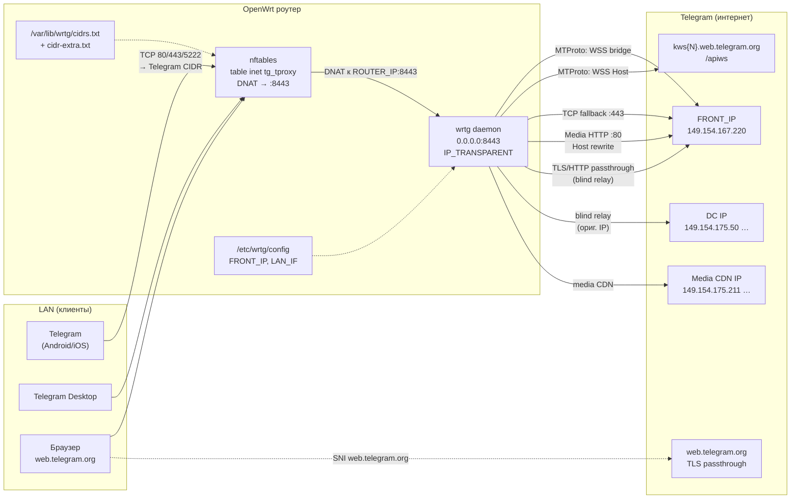
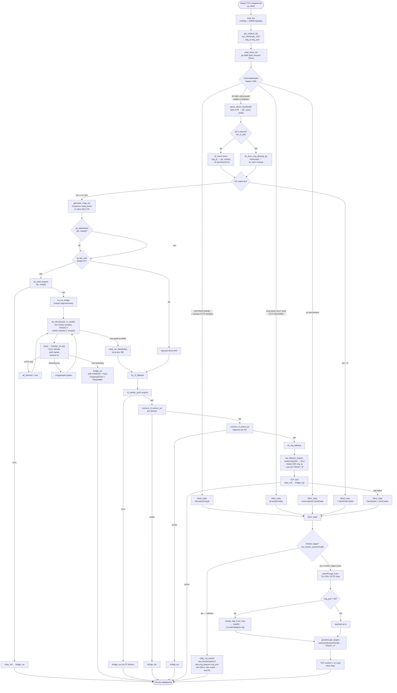
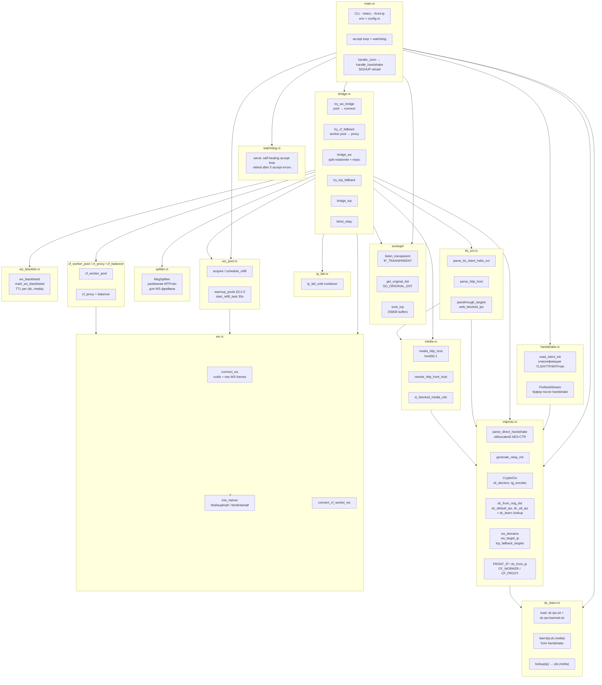
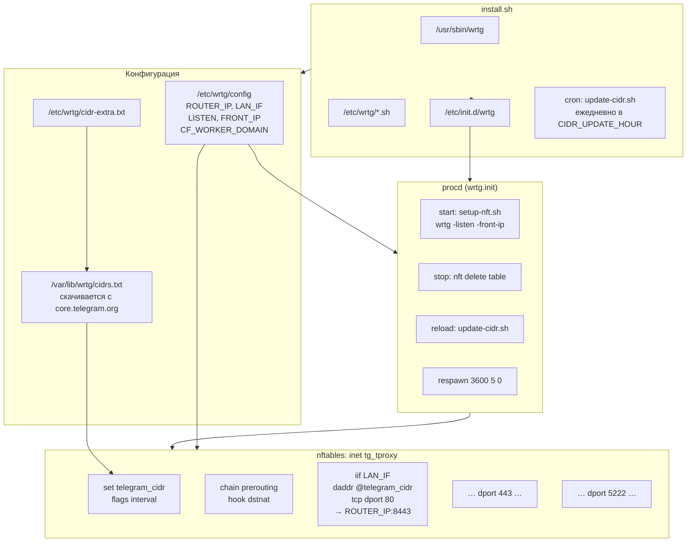

# Архитектура wrtg

**wrtg** — прозрачный прокси Telegram для OpenWrt. Роутер перехватывает TCP-трафик к IP Telegram через **DNAT** (без kernel TPROXY), демон слушает `:8443` с `IP_TRANSPARENT` и восстанавливает оригинальный адрес через **`SO_ORIGINAL_DST`**. Для MTProto строит direct-bridge: расшифровывает obfuscated2 handshake клиента, генерирует relay-init, шифрует трафик в обе стороны и подключается к Telegram через **WSS** (`kws{N}.web.telegram.org`) или **TCP fallback** на `FRONT_IP`.

---

## A. Высокоуровневая архитектура системы



**Порты перехвата:** TCP `80`, `443`, `5222` → `ROUTER_IP:8443`  
**CIDR:** официальный `cidr.txt` Telegram + `/etc/wrtg/cidr-extra.txt`  
**UDP (звонки/WebRTC):** wrtg **не** проксирует — только TCP-сигналинг

---

## B. Внутренний поток обработки соединения



### Ключевые решения по веткам

| Условие | Действие |
|---------|----------|
| `FRONT_IP` задан (по умолчанию `149.154.167.220`) | WS и TCP fallback идут на него **только для DC из `WRTG_FRONT_DCS`** (default `2,4`); прочие DC → real IP |
| Per-DC `DC{N}_FRONT_IP` / `WRTG_DC_IPS` | WS/TCP для конкретного DC на указанный IP (важнее скоупа) |
| DC не в пакете | Определяется по `orig_ip` (alt media IP или default DC) |
| Media DC (`dc_idx < 0` в handshake) | `kws{N}-1.web.telegram.org`, приоритет orig CDN IP |
| Все WS → HTTP 302 | DC помечается в `ws_blacklist` с TTL, WS пропускается до истечения |
| WS timeout к FRONT_IP | `ip_fail_until` — пропуск direct WS на cooldown |
| Пул WS готов | `acquire(dc, media)` — мгновенный bridge без нового handshake |
| CF Worker / CF Proxy | Fallback после direct WS: Worker pool → Worker → Proxy balancer |
| Media + WS blacklist | TCP fallback через front IP (не blind relay к CDN) |
| `web.telegram.org` / `*.telesco.pe` в SNI | Passthrough на `FRONT_IP`, ClientHello не меняется |
| Media CDN HTTP :80 | Переписывается заголовок `Host` → `kws{N}-1.web.telegram.org` |
| Passthrough + Worker задан (v0.4.3+) | Туннель raw байт через Worker к `orig_ip:orig_port` (media/emoji к real DC); fallback на front |
| Handshake с DC в пакете (v0.4.4) | `dc_learn::learn(orig_ip, dc, media)` → persist в `dc-ips-learned.txt` |
| Handshake без DC (v0.4.4) | `dc_from_orig_dst` = hardcoded → `dc_learn::lookup` → иначе blind_relay |

**Протоколы MTProto:** abridged (`0xEF×4`), intermediate (`0xEE×4`), padded (`0xDD×4`)

---

## C. Диаграмма компонентов (модули Rust)



---

## D. Архитектура развёртывания на OpenWrt



### ASCII-схема сетевого пути

```
[Клиент LAN]                    [OpenWrt]                         [Интернет]
     │                               │                                  │
     │  TCP dst=149.154.175.50:443   │                                  │
     ├──────────────────────────────►│                                  │
     │                               │  nft prerouting (tg_tproxy)      │
     │                               │  ip daddr @telegram_cidr         │
     │                               │  dport {80,443,5222}             │
     │                               │  DNAT → 192.168.x.x:8443         │
     │                               │                                  │
     │                               │  wrtg accept (IP_TRANSPARENT)    │
     │                               │  SO_ORIGINAL_DST → 149.154...:443│
     │                               │                                  │
     │  ◄──── bidirectional ────────►│──── WSS/TCP/passthrough ────────►│
     │      (клиент думает, что       │     FRONT_IP или orig DC IP      │
     │       говорит с Telegram)      │                                  │
```

**Таблица `tg_tproxy`:** `inet`, set `telegram_cidr`, chain `prerouting` (priority `dstnat`)  
**Интерфейс:** `LAN_IF` (по умолчанию `eth0`)  
**Сервис:** `START=95`, procd с автоперезапуском  
**Обновление CIDR:** `update-cidr.sh` пересобирает nft set из `cidrs.txt`

---

## E. Пояснение

**wrtg** решает задачу прозрачного обхода блокировок Telegram на уровне роутера: клиентам не нужно настраивать прокси. Весь TCP-трафик к подсетям Telegram (из официального CIDR-списка) перенаправляется DNAT-правилами nftables на локальный демон. Демон слушает порт `8443` с флагом `IP_TRANSPARENT` и через `SO_ORIGINAL_DST` узнаёт, к какому IP и порту Telegram клиент изначально обращался — это критично для определения дата-центра (DC1–DC5, DC203) и типа соединения (обычный или media).

При получении соединения демон читает первые байты и классифицирует трафик. Если это TLS (браузер `web.telegram.org`) или HTTP — выполняется **blind relay**: соединение пробрасывается на `FRONT_IP` (`149.154.167.220` по умолчанию) с сохранением оригинального ClientHello или с переписыванием HTTP `Host` для media CDN. Если это MTProto obfuscated2 (64-байтный handshake) — демон расшифровывает его, строит криптоконтекст из четырёх AES-256-CTR потоков и пытается подключиться к Telegram через WebSocket (`wss://FRONT_IP:443`, Host: `kws{N}.web.telegram.org` или `kws{N}-1.web.telegram.org`, путь `/apiws`). Сначала проверяется **пул предустановленных WS** (`ws_pool`): при наличии готового соединения relay-init отправляется сразу. При неудаче WS (включая HTTP 302 от блокировки) — TCP fallback на `:443`, затем снова blind relay. DC, получившие только 302 на все WS-домены, попадают в runtime-blacklist с настраиваемым TTL и дальше сразу идут на TCP.

### WS split read/write

В `bridge_ws` TLS-сокет WebSocket разделяется на независимые половины (`into_halves` в `ws.rs`): отдельные tokio-задачи для чтения (`WsReadHalf`) и записи (`WsWriteHalf`), связанные через `mpsc`-каналы. Это устраняет блокировку отправки при ожидании recv на одном сокете (аналог concurrent reader + writer в Go-версии).

### WS connection pool

Модуль `ws_pool.rs` при старте (`warmup_pools`) и каждые 30 с (`start_refill_task`) поддерживает пул готовых WSS-соединений per `(DC, media)` на `FRONT_IP`. Размер пула и TTL задаются env-переменными. После использования соединения из пула вызывается `schedule_refill` для пополнения.

Развёртывание автоматизировано скриптом `install.sh`: бинарник, конфиг `/etc/wrtg/config`, nft-правила, procd-сервис и ежедневное обновление CIDR. Важное ограничение: wrtg покрывает только **TCP** (сигналинг MTProto, web, media HTTP). Голосовые и видеозвонки используют **UDP/WebRTC** (рефлекторы `91.108.x.x`, порты 596–599, STUN 3478) — это **вне scope** wrtg; UDP не проксируется.

---

## F. Справочник констант из кода

| Параметр | Значение |
|----------|----------|
| Listen | `0.0.0.0:8443` |
| FRONT_IP (default) | `149.154.167.220` |
| WS domains | `kws{dc}.web.telegram.org`, `kws{dc}-1.web.telegram.org` |
| WS path | `/apiws` |
| DC default IPs | DC1 `149.154.175.50`, DC2 `149.154.167.51`, DC3 `149.154.175.100`, DC4 `149.154.167.91`, DC5 `149.154.171.5`, DC203 `91.105.192.100` |
| DNAT ports | 80, 443, 5222 |
| nft table | `inet tg_tproxy` |
| Handshake size | 64 bytes (obfuscated2) |
| WS pool size (default) | 2 per (DC, media), max 8 |
| WS pool TTL (default) | 120 s |
| WS blacklist TTL (default) | 2700 s (45 min) |
| Pool refill interval | 30 s |

---

## G. Отличие от Flowseal/tg-ws-proxy

| Аспект | tg-ws-proxy | wrtg |
|--------|-------------|------|
| Режим | Локальный MTProxy (secret, FakeTLS) | Прозрачный DNAT, direct-bridge |
| Настройка клиента | `tg://proxy?...` | Не нужна |
| MTProxy-слой | Да (ee-secret) | Нет |
| Fallback chain | CF Worker → CF Proxy → Direct WS → TCP | skip WS → pool WS → direct WS → CF Worker pool → CF Proxy → TCP → blind relay |
| Пул соединений | `ws_pool`, `cf_worker_pool` | `ws_pool`, `cf_worker_pool` (DC1–5, media/normal) |
| Per-DC blacklist | — | `ws_blacklist` с TTL (HTTP 302) |
| Per-DC front IP | `dc_redirects` | `DC{N}_FRONT_IP` / `WRTG_DC_IPS` + global `FRONT_IP` |
| ip_fail cooldown | `ip_fail_until` | `ip_fail_until` (`WRTG_IP_FAIL_COOLDOWN_SEC`) |

---

## H. Переменные окружения

| Переменная | Описание | По умолчанию |
|------------|----------|--------------|
| `WRTG_FRONT_IP` | Front IP (приоритет над `FRONT_IP`) | — |
| `FRONT_IP` | Глобальный front IP из `/etc/wrtg/config` | `149.154.167.220` |
| `WRTG_FRONT_DCS` | Скоуп FRONT_IP: `2,4`/`all`/`none`/список; прочие DC → real IP | `2,4` |
| `DC{N}_FRONT_IP` | Per-DC front IP override (важнее `WRTG_FRONT_DCS`) | — |
| `WRTG_DC_IPS` | Per-DC overrides: `1:ip,2:ip` | — |
| `TG_TPROXY_FRONT_IP` | Legacy alias для front IP | — |
| `CF_WORKER_DOMAIN` | Cloudflare Worker (через запятую) | пусто |
| `CF_PROXY_DOMAIN` | Cloudflare-proxied домен (через запятую) | пусто |
| `WRTG_NO_CFPROXY` | Отключить CF fallback | выкл |
| `WRTG_NO_WORKER_PASSTHROUGH` | Не туннелировать media passthrough через Worker | выкл |
| `WRTG_DC_LEARN_FILE` | Persist-файл learned IP→DC | `/etc/wrtg/dc-ips-learned.txt` |
| `WRTG_DC_IPS_FILE` | Админский IP→DC файл (загрузка при старте) | `/etc/wrtg/dc-ips.txt` |
| `WRTG_IP_FAIL_COOLDOWN_SEC` | Cooldown после WS timeout к front IP | `3600` |
| `WRTG_WS_POOL_SIZE` | Размер пула WS per (DC, media) | `2` (max 8) |
| `WRTG_WS_POOL_TTL_SEC` | TTL соединений в пуле | `120` |
| `WRTG_CF_WORKER_POOL_SIZE` | Размер CF Worker pool per DC | `2` (max 4) |
| `WRTG_CF_WORKER_POOL_TTL_SEC` | TTL CF Worker pool | `120` |
| `WRTG_WS_BLACKLIST_TTL_SEC` | TTL blacklist после HTTP 302 | `2700` |
| `WRTG_LISTEN` | Listen address override | `0.0.0.0:8443` |

CLI: `--listen ADDR`, `--front-ip IP`. SIGHUP (`/etc/init.d/wrtg reload`) перечитывает env без рестарта.
