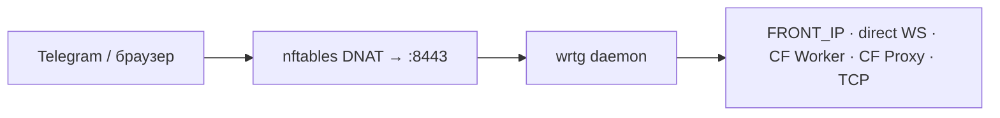
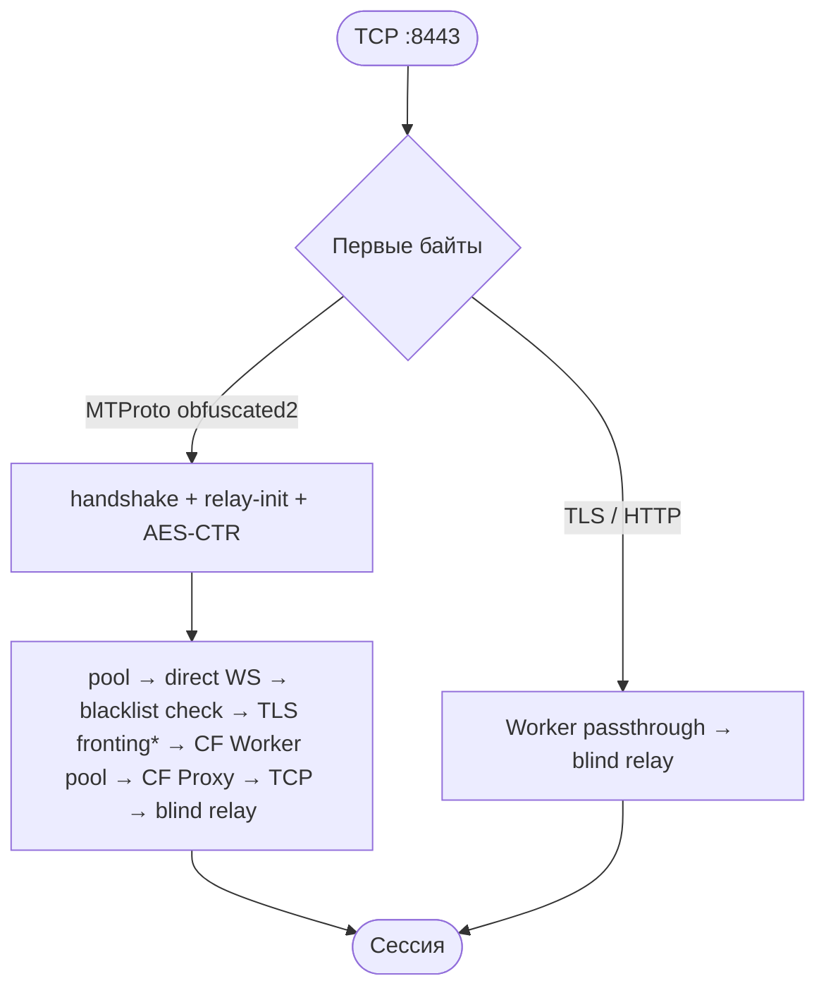

# wrtg — руководство

**Version:** 0.5.6 · **Last updated:** 2026-07-10

Единый документ: что это, архитектура, установка, настройка, Cloudflare fallback и диагностика.  
История релизов — [`CHANGELOG.md`](../CHANGELOG.md). Исходник CF Worker — [`openwrt/cf-worker.js`](../openwrt/cf-worker.js).

---

## Что такое wrtg

**wrtg** — прозрачный TCP-прокси Telegram для OpenWrt. Клиентам не нужно настраивать прокси: nftables перенаправляет исходящий TCP к IP Telegram (порты 80, 443, 5222) на локальный демон, который расшифровывает MTProto handshake и перенаправляет трафик через WebSocket, Cloudflare Worker или прямое TCP-соединение. Работает через **DNAT** и `SO_ORIGINAL_DST`, без kernel TPROXY.

---

## Сокращения

| Термин | Расшифровка |
|--------|-------------|
| **DNAT** | Destination NAT — подмена адреса назначения в nftables; клиент думает, что идёт на IP Telegram, а пакет попадает на роутер. |
| **DC** | Data Center — дата-центр Telegram (DC1…DC5, DC203). |
| **MTProto** | Протокол Telegram; wrtg обрабатывает obfuscated2 handshake (64 байта). |
| **WSS** | WebSocket over TLS — `wss://kws{N}.web.telegram.org/apiws`. |
| **FRONT_IP** | IP «фронта» Telegram (по умолчанию `149.154.167.220`); WS-подключение идёт сюда, Host остаётся `kws{N}.web.telegram.org`. |
| **CF Worker** | Cloudflare Worker — serverless-скрипт на `*.workers.dev`; WSS/TCP fallback и media passthrough. |
| **CF Proxy** | Домен за Cloudflare CDN (оранжевое облако); альтернативный WSS fallback через `wss://kws{N}.<domain>/apiws`. |
| **dc_learn** | Self-learning: из handshake запоминается соответствие `orig_ip → DC` в `dc-ips-learned.txt`. |
| **Worker passthrough** | Туннель TLS/HTTP media (emoji, стикеры) через CF Worker к реальному `dst:port` Telegram. |
| **TLS fronting** | Opt-in: TCP к целевому IP, SNI из `WRTG_FRONTING_SNI`, Host `kws{N}.web.telegram.org`. |
| **blind relay** | Проброс байт без расшифровки MTProto (TLS, HTTP, нераспознанный трафик). |
| **ws_blacklist** | TTL-блокировка DC после HTTP 302 на все WS-домены; direct WS пропускается. |
| **DoH** | DNS over HTTPS — резолв CF Proxy доменов при fallback. |

---

## Архитектура

### Развёртывание



1. **nftables** (`inet tg_tproxy`, chain `prerouting`) перехватывает TCP 80/443/5222 к CIDR Telegram + `/etc/wrtg/cidr-extra.txt`.
2. **DNAT** перенаправляет на `ROUTER_IP:8443`.
3. **wrtg** слушает с `IP_TRANSPARENT`, восстанавливает оригинальный адрес через `SO_ORIGINAL_DST`.

| Компонент | Путь |
|-----------|------|
| Бинарник | `/usr/sbin/wrtg` |
| Конфиг | `/etc/wrtg/config` |
| CIDR | `/var/lib/wrtg/cidrs.txt` |
| Init | `/etc/init.d/wrtg` (procd, START=95) |

### Поток соединения



\* TLS fronting — только при `WRTG_FRONTING_SNI`.

**Fallback chain (MTProto):**

1. **Direct WS pool** — переиспользование открытого WSS (non-media, DC с настроенным front).
2. **Direct WS** — новое WSS на `FRONT_IP` или реальный IP DC (`WRTG_FRONT_DCS`, `DC{N}_FRONT_IP`).
3. **ws_blacklist** — если все WS-домены DC вернули HTTP 302, direct WS пропускается до истечения TTL.
4. **TLS fronting** — opt-in, cooldown после неудачи.
5. **CF Worker pool / direct** — WSS через ваш Worker; параллельный race по нескольким Worker.
6. **CF Proxy** — WSS через свой домен или opt-in публичный pool (`WRTG_CFPROXY_AUTO=1`).
7. **TCP fallback** — прямое TCP на FRONT_IP или media CDN.
8. **blind relay** — если ничего не сработало или трафик не MTProto.

**Дополнительно:**

| Механизм | Назначение |
|----------|------------|
| `dc_learn` | Запоминает `orig_ip → DC` из handshake → `dc-ips-learned.txt`; admin override в `dc-ips.txt`. |
| `ip_fail_until` | Cooldown на FRONT_IP после WS timeout — пропуск direct WS. |
| Worker passthrough | TLS/HTTP media через `wss://worker/apiws?dst=ip&port=` к реальному DC. |

### Модули (Rust)

| Модуль | Роль |
|--------|------|
| `main`, `handshake`, `mtproto` | Accept, классификация, crypto |
| `bridge`, `ws`, `tls` | Relay, WSS, TLS passthrough |
| `ws_pool`, `cf_worker_pool` | Bounded connection pools |
| `ws_blacklist`, `ip_fail` | TTL blacklist, FRONT_IP cooldown |
| `dc_learn` | IP → DC mapping |
| `cf_proxy`, `cf_balancer`, `cf_proxy_domains` | CF Proxy fallback, DoH, auto-pool |
| `config`, `watchdog`, `sockopt` | Startup, listener recovery, transparent socket |

---

## Установка

```sh
wget -qO- https://github.com/onebany/wrtg/raw/branch/main/bootstrap.sh | sh
```

`bootstrap.sh` скачивает релиз и запускает `install.sh` (бинарник, конфиг, nft, cron, LuCI).  
Релизы: [Gitea](https://github.com/onebany/wrtg/releases), [GitHub](https://github.com/onebany/wrtg/releases).

Опции через env: `VER=v0.5.6`, `WRTG_BASE_URL`, `WRTG_REPO=onebany/wrtg`, `ASSUME_YES=1`, `SKIP_LUCI=1`, `CF_WORKER_DOMAIN=…`.

После установки:

```sh
/etc/init.d/wrtg status
wrtg --check
```

Удаление: `sh uninstall.sh` (или `FORCE=1 sh uninstall.sh`).

---

## Настройка

Файл `/etc/wrtg/config`. Изменения daemon config — **`/etc/init.d/wrtg restart`** (`reload` = alias).  
Только CIDR/nft: `/etc/wrtg/update-cidr.sh`.

### Основное

| Переменная | Описание | По умолчанию |
|------------|----------|--------------|
| `ROUTER_IP` | LAN IP роутера (цель DNAT) | авто при install |
| `LAN_IF` | Интерфейс LAN | авто (`br-lan`) |
| `LISTEN` / `WRTG_LISTEN` | Адрес демона | `0.0.0.0:8443` |
| `FRONT_IP` / `WRTG_FRONT_IP` | Front IP для WS и TCP | `149.154.167.220` |
| `WRTG_FRONT_DCS` | Каким DC применять FRONT_IP: `2,4` / `all` / `none` / список | `2,4` |
| `DC{N}_FRONT_IP` | Per-DC front IP (важнее скоупа) | — |
| `WRTG_DC_IPS` | Per-DC: `1:ip,2:ip` | — |

DC1/DC3/DC5 часто отвечают HTTP 302 на direct WS — для них нужен **CF Worker** (см. ниже).

### IP → DC (dc_learn)

| Переменная | Описание | По умолчанию |
|------------|----------|--------------|
| `WRTG_DC_LEARN_FILE` | Learned mappings | `/etc/wrtg/dc-ips-learned.txt` |
| `WRTG_DC_IPS_FILE` | Admin override | `/etc/wrtg/dc-ips.txt` |

Формат файлов: `<IP> <DC> [media]` (по строке).

### Cloudflare fallback

| Переменная | Описание | По умолчанию |
|------------|----------|--------------|
| `CF_WORKER_DOMAIN` | Worker hostname(s), через запятую | пусто |
| `WRTG_CF_WORKER_TOKEN` | Secret = Worker `WRTG_TOKEN` | пусто |
| `CF_PROXY_DOMAIN` | Свой CF-proxied домен(s) | пусто |
| `WRTG_CFPROXY_AUTO` | Opt-in публичный CF Proxy pool | `0` |
| `WRTG_NO_CFPROXY` | Отключить весь CF fallback | выкл |
| `WRTG_NO_WORKER_PASSTHROUGH` | Не туннелировать media через Worker | выкл |

### Таймауты и пулы

| Переменная | Описание | По умолчанию |
|------------|----------|--------------|
| `WRTG_WS_POOL_SIZE` | Direct WS pool per DC (max 8) | `2` |
| `WRTG_WS_POOL_TTL_SEC` | Pool TTL | `120` |
| `WRTG_CF_WORKER_POOL_SIZE` | CF Worker pool per (DC, media), max 4 | `2` |
| `WRTG_CF_WORKER_POOL_TTL_SEC` | CF Worker pool TTL | `120` |
| `WRTG_WS_BLACKLIST_TTL_SEC` | Blacklist TTL после HTTP 302 | `2700` |
| `WRTG_IP_FAIL_COOLDOWN_SEC` | Cooldown после WS timeout к FRONT_IP | `3600` |
| `WRTG_DC_FAIL_COOLDOWN_SEC` | Adaptive WS timeout per DC | `60` |
| `WRTG_WS_FAIL_TIMEOUT_SEC` | WS connect timeout | `5` |
| `WRTG_WS_FAIL_TIMEOUT_FAST_SEC` | Быстрый timeout после fail | `2` |

### TLS fronting (opt-in)

| Переменная | Описание | По умолчанию |
|------------|----------|--------------|
| `WRTG_FRONTING_SNI` | SNI для fronting (пусто = выкл) | пусто |
| `WRTG_FRONTING_COOLDOWN_SEC` | Cooldown после неудачи | `1800` |

### CF Proxy tuning

| Переменная | Описание | По умолчанию |
|------------|----------|--------------|
| `WRTG_CFPROXY_429_COOLDOWN_SEC` | Начальный 429 cooldown | `45` |
| `WRTG_CFPROXY_429_MAX_COOLDOWN_SEC` | Макс. 429 cooldown | `300` |
| `WRTG_CFPROXY_PARALLEL` | Параллельные CF Proxy попытки | `2` |
| `WRTG_DOH_CACHE_SEC` | DoH cache TTL | `300` |

### Keepalive

| Переменная | Описание | По умолчанию |
|------------|----------|--------------|
| `WRTG_WS_PING_SEC` | Idle WS ping | `30` |
| `WRTG_TCP_KEEPALIVE_SEC` | TCP keepalive | `30` |

CLI: `--listen ADDR`, `--front-ip IP`, `--check`.

### Константы

| Параметр | Значение |
|----------|----------|
| WS hosts | `kws{dc}.web.telegram.org`, `kws{dc}-1.web.telegram.org` (media) |
| WS path | `/apiws` |
| DC IPs | DC1 `149.154.175.50`, DC2 `149.154.167.51`, DC3 `149.154.175.100`, DC4 `149.154.167.91`, DC5 `149.154.171.5`, DC203 `91.105.192.100` |
| nft table | `inet tg_tproxy` |

---

## CF Worker

CF Worker — основной fallback для DC с HTTP 302 (DC1/DC3/DC5) и media passthrough (emoji, стикеры).

### Безопасность

- Только IPv4 из Telegram CIDR; порты 80, 443, 5222.
- Optional secret: `WRTG_TOKEN` в Worker = `WRTG_CF_WORKER_TOKEN` на роутере.
- Используйте актуальный код из `openwrt/cf-worker.js` (не open proxy).

### Развёртывание

1. [Cloudflare Dashboard](https://dash.cloudflare.com) → **Workers & Pages** → **Create Worker**.
2. **Edit code** → вставьте содержимое `openwrt/cf-worker.js` → **Deploy**.
3. **Settings → Variables and Secrets** → encrypted secret `WRTG_TOKEN=<random>` (`openssl rand -hex 32`).
4. Скопируйте hostname `name.username.workers.dev`.
5. На роутере:

```sh
CF_WORKER_DOMAIN="name.username.workers.dev"
WRTG_CF_WORKER_TOKEN="<то же значение>"
/etc/init.d/wrtg restart
```

Несколько Worker через запятую; порядок сохраняется.

---

## CF Proxy (opt-in)

**CF Proxy** — WSS fallback через домен за Cloudflare CDN. Предпочтительнее собственный CF Worker.

### Свой домен

```sh
CF_PROXY_DOMAIN="proxy.example.com"
/etc/init.d/wrtg restart
```

wrtg подключается к `wss://kws{N}[-1].proxy.example.com/apiws`.

### Публичный pool

По умолчанию **выключен** — публичные списки доменов ненадёжны и могут быть заблокированы ISP.

```sh
WRTG_CFPROXY_AUTO="1"
/etc/init.d/wrtg restart
```

Не более трёх доменов на соединение; список обновляется раз в час.

Рекомендация: свой Worker или свой `CF_PROXY_DOMAIN`.

---

## Диагностика

### Быстрая проверка

```sh
/etc/init.d/wrtg status
wrtg --check          # DNS + WSS probes; exit 0 = OK
logread -e wrtg | tail
nft list table inet tg_tproxy
```

Откройте Telegram в LAN — в логах: `direct handshake OK` или `WS connected`.

### `wrtg --check`

Проверяет DNS и WSS для FRONT_IP, CF Worker и CF Proxy. Не запускает демон.

### CF Worker

```sh
nslookup name.username.workers.dev
curl -i https://name.username.workers.dev/apiws   # ожидается 426 без WS Upgrade
logread -e wrtg | grep -E 'CF worker|worker passthrough'
```

| Симптом | Решение |
|---------|---------|
| `cf-workers=0` | Проверьте `CF_WORKER_DOMAIN`, restart |
| HTTP 403 | Secret mismatch или destination вне CIDR |
| TLS error | Hostname, DNS, время на роутере |
| Timeout | Доступ к `*.workers.dev` с роутера (`curl`, `nslookup`) |

### CF Proxy

```sh
nslookup kws1.proxy.example.com
curl -i https://kws1.proxy.example.com/apiws
logread -e wrtg | grep -i 'CF proxy'
```

При нестабильном публичном pool выключите `WRTG_CFPROXY_AUTO` и используйте свой Worker или домен.

### Общие проблемы

| Симптом | Что проверить |
|---------|---------------|
| Telegram не подключается | `wrtg --check`, nft rules, `ROUTER_IP`/`LAN_IF` |
| HTTP 302 на WS | Настройте `CF_WORKER_DOMAIN` |
| Emoji/стикеры не грузятся | Worker passthrough (`CF_WORKER_DOMAIN`, не `WRTG_NO_WORKER_PASSTHROUGH`) |
| Медленный fallback | Отключите `WRTG_CFPROXY_AUTO`, используйте свой Worker |

---

## Ограничения

- **Голос/видео** — UDP/WebRTC не проксируется; wrtg перехватывает только TCP (сигналинг).
- **IPv4 only** — `SO_ORIGINAL_DST` работает только с IPv4.
- **Worker deploy** — изменение `openwrt/cf-worker.js` требует отдельного deploy в Cloudflare.
- **Публичный CF Proxy pool** — opt-in, не контролируется проектом.

---

## Проверки перед релизом (разработчикам)

```sh
make bundle
cargo fmt --all -- --check
cargo clippy -p wrtg --all-targets -- -D warnings
cargo test -p wrtg
shellcheck -x install.sh bootstrap.sh uninstall.sh build-rust.sh \
  openwrt/*.sh openwrt/wrtg.init openwrt/luci-app-wrtg/install-luci.sh
sh build-rust.sh amd64
node --check openwrt/cf-worker.js
```
