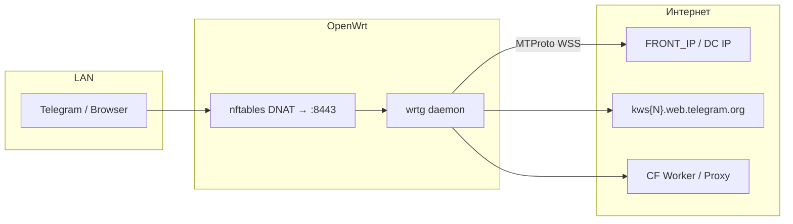
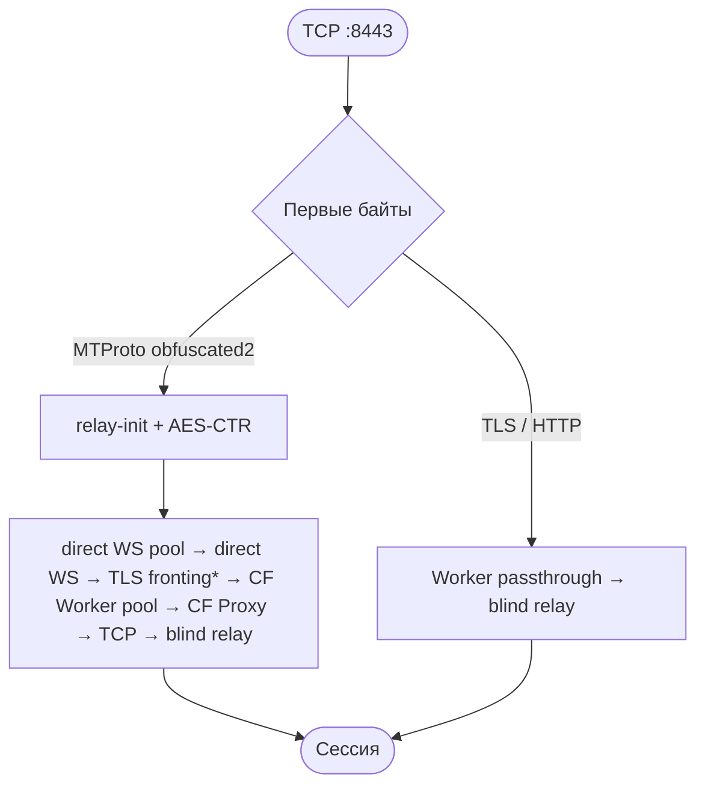

# wrtg — руководство

**Version:** 0.5.5 · **Last updated:** 2026-07-10

Единый документ: архитектура, развёртывание, CF Worker/Proxy, конфигурация и проверки.
История релизов — [`CHANGELOG.md`](../CHANGELOG.md). Исходник Worker — [`openwrt/cf-worker.js`](../openwrt/cf-worker.js).

## Принципы

- wrtg **не зависит от zapret**; диагностика начинается с DNS и HTTPS/WSS.
- Scope — **TCP** 80/443/5222; UDP/WebRTC (звонки) **не проксируется**.
- CF Worker — основной fallback для DC, недоступных через direct WS.
- `/etc/wrtg/config` применяется полным **`restart`** (`reload` = alias).
- Публичные Worker/Proxy endpoints не должны отключать TLS или становиться open proxy.

---

## Архитектура

**wrtg** — прозрачный прокси Telegram для OpenWrt. nftables **DNAT** перехватывает TCP к CIDR Telegram; демон слушает `:8443` с `IP_TRANSPARENT` и восстанавливает адрес через **`SO_ORIGINAL_DST`**.



**Порты перехвата:** TCP 80, 443, 5222 → `ROUTER_IP:8443`  
**CIDR:** `core.telegram.org/cidr.txt` + `/etc/wrtg/cidr-extra.txt`

### Поток соединения



\* TLS fronting — opt-in (`WRTG_FRONTING_SNI`).

| Условие | Действие |
|---------|----------|
| `FRONT_IP` (default `149.154.167.220`) | WS/TCP только для DC из `WRTG_FRONT_DCS` (default `2,4`) |
| `DC{N}_FRONT_IP` / `WRTG_DC_IPS` | Per-DC override, важнее скоупа |
| Все WS → HTTP 302 | `ws_blacklist` с TTL, WS пропускается |
| WS timeout к FRONT_IP | `ip_fail_until` cooldown |
| Direct WS pool (non-media) | `ws_pool::acquire` — без нового TLS handshake |
| CF fallback | Worker pool → Worker → Proxy (DoH, 429 cooldown, parallel race) |
| Passthrough + Worker | Raw tunnel `wss://worker/apiws?dst=ip&port=` |
| Handshake с DC | `dc_learn::learn` → `dc-ips-learned.txt` |

**Модули:** `main`/`handshake`/`mtproto` — accept и crypto; `bridge`/`ws`/`tls` — relay; `ws_pool`/`cf_worker_pool` — pools; `dc_learn` — IP→DC; `config`/`cf_balancer`/`cf_proxy_*` — startup и fallback; `sockopt`/`watchdog` — transparent socket и accept recovery.

### Развёртывание на OpenWrt

```
[Клиент] ──TCP dst=Telegram IP:443──► [nft DNAT → ROUTER_IP:8443]
                                              │
                                         wrtg (SO_ORIGINAL_DST)
                                              │
                                         WSS / TCP / passthrough ──► интернет
```

| Компонент | Путь |
|-----------|------|
| Бинарник | `/usr/sbin/wrtg` |
| Конфиг | `/etc/wrtg/config` |
| CIDR | `/var/lib/wrtg/cidrs.txt` |
| Init | `/etc/init.d/wrtg` (procd, START=95) |
| nft | table `inet tg_tproxy`, chain `prerouting` |

#### Установка

**На роутере (рекомендуется)** — bootstrap без git/Rust:

```sh
wget -qO- https://git.onebany.dedyn.io/bany/wrtg/raw/branch/main/bootstrap.sh | sh
```

`bootstrap.sh` скачивает `wrtg-openwrt.tar.gz` (если есть в релизе) или собирает установку из release-бинарника + source archive, затем запускает `install.sh` с `SKIP_BUILD=1`.

Релизы: [Gitea](https://git.onebany.dedyn.io/bany/wrtg/releases) (основной), [GitHub](https://github.com/onebany/wrtg/releases). Переменные: `VER=v0.5.5`, `WRTG_BASE_URL`, `WRTG_REPO=onebany/wrtg` (GitHub mode).

**С ПК (разработчик):**

```sh
ROUTER=root@192.168.20.254 sh install.sh
```

**Обновить только демон:**

```sh
VER=v0.5.5 ARCH=arm64
wget -O /tmp/wrtg "https://git.onebany.dedyn.io/bany/wrtg/releases/download/${VER}/wrtg-linux-${ARCH}"
install -m 755 /tmp/wrtg /usr/sbin/wrtg && /etc/init.d/wrtg restart
```

**С ПК без Rust:**

```sh
VER=v0.5.5 ARCH=arm64
git clone https://git.onebany.dedyn.io/bany/wrtg.git && cd wrtg
mkdir -p dist
wget -O dist/wrtg-linux-${ARCH} "https://git.onebany.dedyn.io/bany/wrtg/releases/download/${VER}/wrtg-linux-${ARCH}"
chmod +x dist/wrtg-linux-${ARCH}
SKIP_BUILD=1 ROUTER=root@192.168.20.254 sh install.sh
```

Для публикации полного bundle в Gitea: `make bundle` → загрузить `dist/wrtg-openwrt.tar.gz` и `dist/SHA256SUMS`.

`install.sh` собирает/копирует бинарник, конфиг, nft, cron (`update-cidr.sh`), LuCI.

---

## Cloudflare Worker

Worker обеспечивает WSS/TCP fallback и media passthrough (`port=80|443|5222`), когда direct WS недоступен или возвращает HTTP 302.

### Безопасность (0.5.0+)

- Только IPv4 из Telegram CIDR; порты 80, 443, 5222.
- Optional secret `WRTG_TOKEN` / `WRTG_CF_WORKER_TOKEN`.
- Замените старый Worker без ограничений кодом из `openwrt/cf-worker.js`.

### Развёртывание

1. Cloudflare Dashboard → **Workers & Pages** → **Create Worker**.
2. **Edit code** → вставьте содержимое `openwrt/cf-worker.js` → **Deploy**.
3. **Settings → Variables and Secrets** → encrypted secret `WRTG_TOKEN=<random>` (`openssl rand -hex 32`).
4. Скопируйте hostname `name.username.workers.dev`.
5. На роутере:

```sh
CF_WORKER_DOMAIN="name.username.workers.dev"
WRTG_CF_WORKER_TOKEN="<то же значение>"
/etc/init.d/wrtg restart
```

Несколько Worker через запятую; порядок сохраняется.

### Проверка Worker

```sh
nslookup name.username.workers.dev
curl -i https://name.username.workers.dev/apiws   # ожидается 426 без WS Upgrade
logread -e wrtg | grep -E 'CF worker|worker passthrough'
wrtg --check
```

| Симптом | Решение |
|---------|---------|
| `cf-workers=0` | Проверьте `CF_WORKER_DOMAIN`, restart |
| HTTP 403 | Secret mismatch или destination вне CIDR |
| TLS error | Hostname, DNS, время на роутере |
| Timeout | Доступ к `*.workers.dev` с роутера |

---

## CF Proxy fallback

Дополнительный WSS fallback через Cloudflare-proxied домен. Предпочтительнее собственный Worker.

### Собственный домен

```sh
CF_PROXY_DOMAIN="proxy.example.com"
/etc/init.d/wrtg restart
```

wrtg подключается к `wss://kws{N}[-1].proxy.example.com/apiws`.

### Публичный pool

Автопул Flowseal **выключен** по умолчанию. Явное включение:

```sh
WRTG_CFPROXY_AUTO="1"
/etc/init.d/wrtg restart
```

Не более трёх доменов на соединение; список обновляется раз в час после валидации ≥3 доменов.

### Диагностика CF Proxy

```sh
nslookup kws1.proxy.example.com
curl -i https://kws1.proxy.example.com/apiws
logread -e wrtg | grep -i 'CF proxy'
wrtg --check
```

При нестабильном публичном pool выключите `WRTG_CFPROXY_AUTO` и используйте свой Worker или домен.

---

## Переменные окружения

| Переменная | Описание | По умолчанию |
|------------|----------|--------------|
| `WRTG_FRONT_IP` / `FRONT_IP` | Front IP для WS bridge | `149.154.167.220` |
| `WRTG_FRONT_DCS` | Скоуп FRONT_IP: `2,4`/`all`/`none`/список | `2,4` |
| `DC{N}_FRONT_IP` | Per-DC front IP | — |
| `WRTG_DC_IPS` | Per-DC: `1:ip,2:ip` | — |
| `CF_WORKER_DOMAIN` | Worker hostname(s), через запятую | пусто |
| `WRTG_CF_WORKER_TOKEN` | Secret = Worker `WRTG_TOKEN` | пусто |
| `CF_PROXY_DOMAIN` | CF-proxied домен(s) | пусто |
| `WRTG_CFPROXY_AUTO` | Публичный CF Proxy pool | `0` |
| `WRTG_NO_CFPROXY` | Отключить CF fallback | выкл |
| `WRTG_NO_WORKER_PASSTHROUGH` | Не туннелировать media passthrough | выкл |
| `WRTG_DC_LEARN_FILE` | Learned IP→DC | `/etc/wrtg/dc-ips-learned.txt` |
| `WRTG_DC_IPS_FILE` | Admin IP→DC | `/etc/wrtg/dc-ips.txt` |
| `WRTG_IP_FAIL_COOLDOWN_SEC` | Cooldown после WS timeout | `3600` |
| `WRTG_FRONTING_SNI` | Opt-in TLS fronting SNI | пусто |
| `WRTG_FRONTING_COOLDOWN_SEC` | Cooldown fronting | `1800` |
| `WRTG_DC_FAIL_COOLDOWN_SEC` | Adaptive WS timeout per DC | `60` |
| `WRTG_WS_FAIL_TIMEOUT_SEC` | WS connect timeout | `5` |
| `WRTG_WS_FAIL_TIMEOUT_FAST_SEC` | Быстрый timeout после fail | `2` |
| `WRTG_WS_POOL_SIZE` | Direct non-media pool per DC (max 8) | `2` |
| `WRTG_WS_POOL_TTL_SEC` | Pool TTL | `120` |
| `WRTG_CF_WORKER_POOL_SIZE` | Worker pool per (DC, media), max 4 | `2` |
| `WRTG_CF_WORKER_POOL_TTL_SEC` | CF Worker pool TTL | `120` |
| `WRTG_WS_BLACKLIST_TTL_SEC` | Blacklist TTL после HTTP 302 | `2700` |
| `WRTG_CFPROXY_429_COOLDOWN_SEC` | Начальный 429 cooldown | `45` |
| `WRTG_CFPROXY_429_MAX_COOLDOWN_SEC` | Макс. 429 cooldown | `300` |
| `WRTG_CFPROXY_PARALLEL` | Параллельные CF proxy попытки | `2` |
| `WRTG_DOH_CACHE_SEC` | DoH cache TTL | `300` |
| `WRTG_WS_PING_SEC` | Idle WS ping | `30` |
| `WRTG_TCP_KEEPALIVE_SEC` | TCP keepalive | `30` |
| `WRTG_LISTEN` | Listen address | `0.0.0.0:8443` |

CLI: `--listen ADDR`, `--front-ip IP`, `--check`.

### Константы

| Параметр | Значение |
|----------|----------|
| WS domains | `kws{dc}.web.telegram.org`, `kws{dc}-1.web.telegram.org` |
| WS path | `/apiws` |
| DC IPs | DC1 `149.154.175.50`, DC2 `149.154.167.51`, DC3 `149.154.175.100`, DC4 `149.154.167.91`, DC5 `149.154.171.5`, DC203 `91.105.192.100` |
| Handshake | 64 bytes obfuscated2 |
| nft table | `inet tg_tproxy` |

---

## Проверки перед релизом

```sh
cargo fmt --all -- --check
cargo clippy -p wrtg --all-targets -- -D warnings
cargo test -p wrtg
shellcheck -x install.sh bootstrap.sh uninstall.sh build-rust.sh \
  openwrt/*.sh openwrt/wrtg.init openwrt/luci-app-wrtg/install-luci.sh
sh build-rust.sh amd64
node --check openwrt/cf-worker.js
```

На роутере: service running, nft loaded, `wrtg --check` exit 0, логи показывают WS/Worker без лишних fallback.

---

## Ограничения

- Голос/видео — UDP/WebRTC, вне scope wrtg.
- `SO_ORIGINAL_DST` — только IPv4.
- Изменение Worker source требует отдельного deploy в Cloudflare.
- Public CF Proxy pool — opt-in, не контролируется проектом.

## vs tg-ws-proxy

| Аспект | tg-ws-proxy | wrtg |
|--------|-------------|------|
| Режим | Локальный MTProxy | Прозрачный DNAT |
| Настройка клиента | Нужна | Не нужна |
| Fallback | CF → Proxy → Direct WS → TCP | pool → WS → fronting → CF Worker → Proxy → TCP → blind relay |
| Blacklist / pools | — | `ws_blacklist`, bounded pools |
| `--check` | — | DNS + WSS probes |
